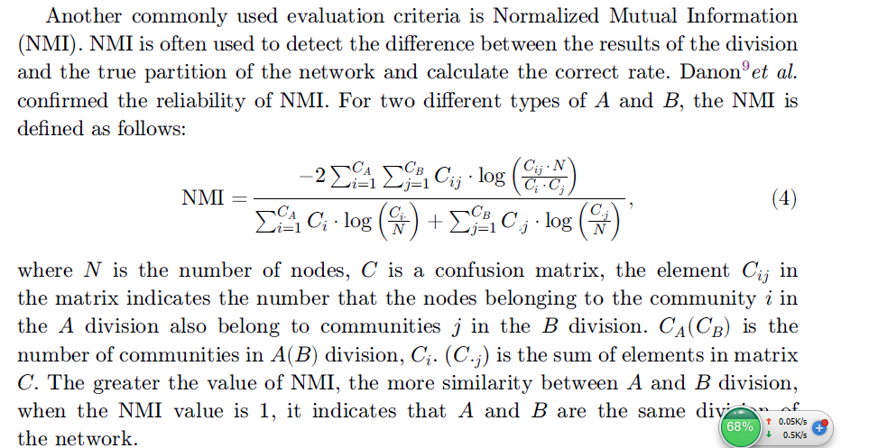
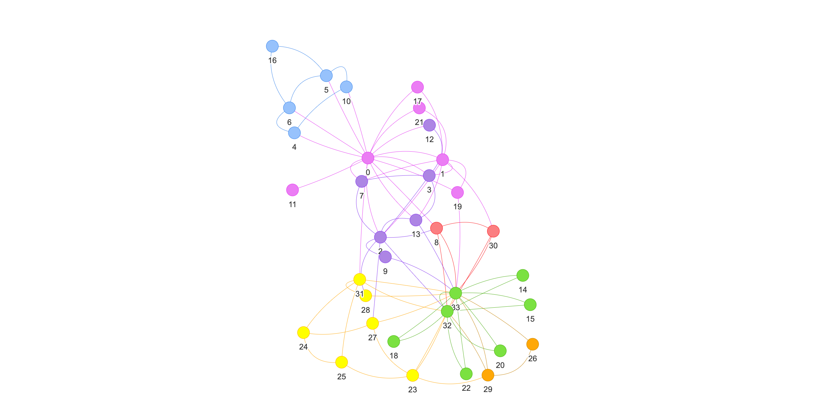
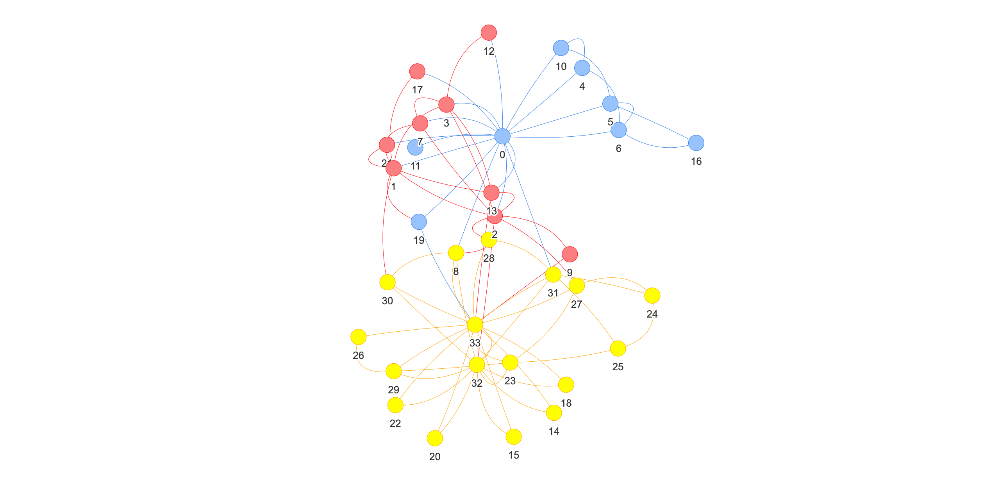
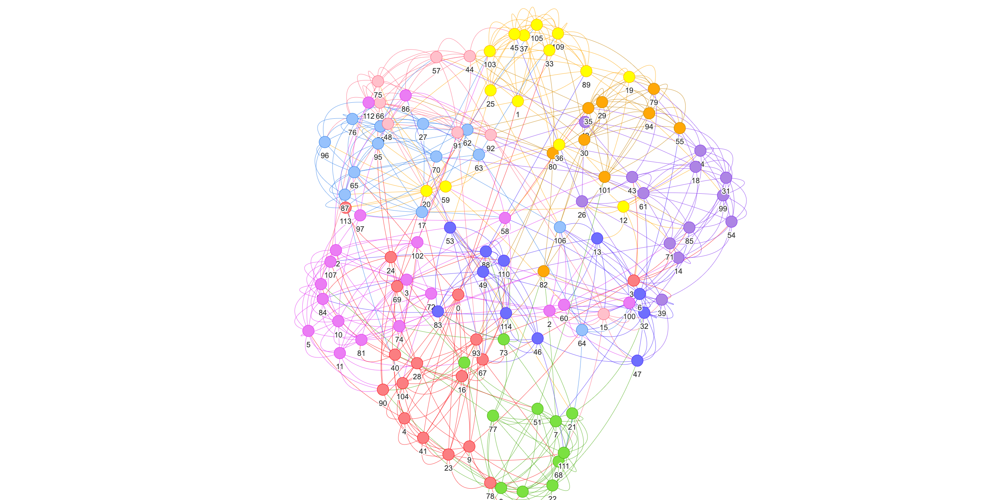
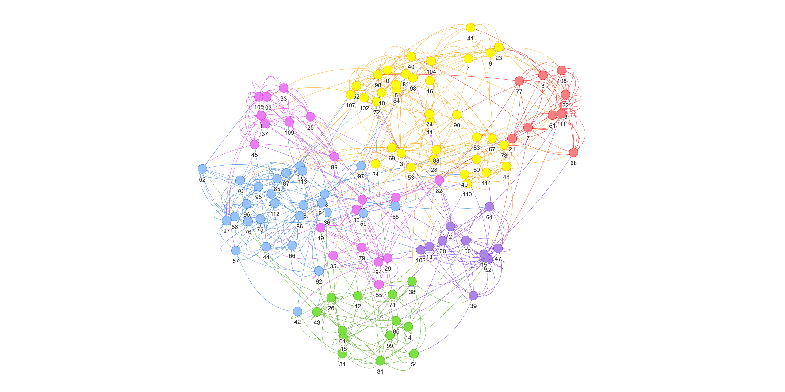
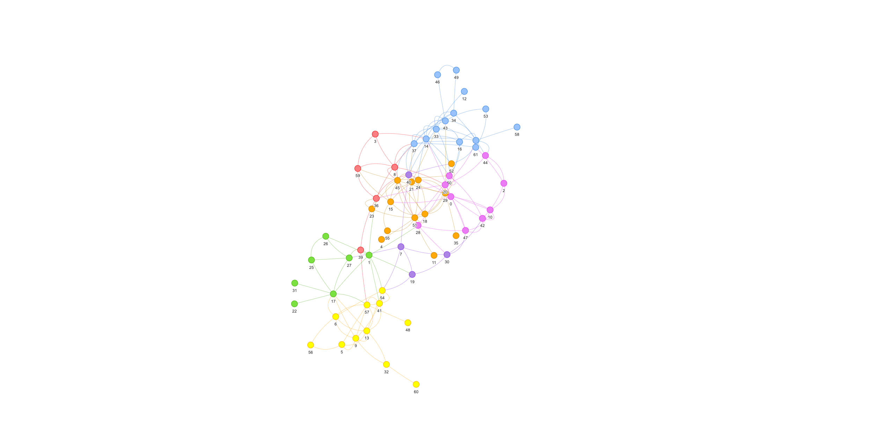
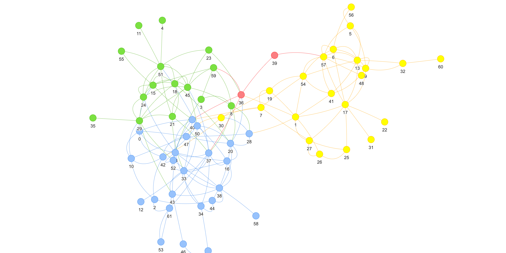

## graphX版louvain测试报告

### 测试数据集

- Zachary karate club

	[txt文件](../data/community_detection/club.txt)
	
	Zachary网络是学者通过对一个美国大学空手道俱乐部进行观测而构建出的一个真实的社会网络。网络中包含 34 个节点和 78 条边，其中个体表示俱乐部中的成员，而边表示成员之间存在的友谊关系。
	
- College Football

	[txt文件](../data/community_detection/football.txt)
	
	College Football网络是根据美国大学生足球联赛创建的一个真实的社会网络。该网络包含 115个节点和 616 条边，其中网络中的结点代表足球队，两个结点之间的边表示两只球队之间进行过一场比赛。参赛的115支大学生代表队被分为12个联盟，联盟即可表示为该网络的真实社区结构。
	
- Dolphin
	
	[txt文件](../data/community_detection/dolphin.txt)
	
	Dolphin数据集是 D.Lusseau 等人使用长达 7 年的时间观察新西兰 Doubtful Sound海峡 62 只海豚群体的交流情况而得到的海豚社会关系网络。这个网络包含 62 个节点，159 条边。节点表示海豚，而边表示海豚间的频繁接触。

### 评估方法

以networkX的划分结果作为参照，计算NMI指数和ARI指数。

- NMI(Normalized Mutual Infomation)

- ARI(Adjusted Rand Index)

其中，a11表示试验社区划分与真实社区划分都属于同一社区的点对数，a00表示试验社区划分与真实社区划分都不属于同一社团的点对数，a10表示真实社区划分属于同一社区而试验社区划分不属于同一社区点对数，a01表示真实社区划分不属于同一社区而试验社区划分属于同一社区点对数。

### 评估结果

|数据集|NMI [0, 1]|ARI [-1, 1]|
|:---:|:---:|:---:|
|Zachary karate club|0.6325803655452913| 0.2815698166020352 |
|College Football|0.5717060265693547| 0.3390473429995927 |
|Dolphin|0.6810460423960621|0.4452258165338334|

club graphX

club networkX

football graphX

football networkX

dolphin graphX

 dolphin networkX

	
	
	
	
### 代码

- [NMI计算](../python/community_detection_eval.py)

- [ARI计算](../python/community_detection_eval.py)
